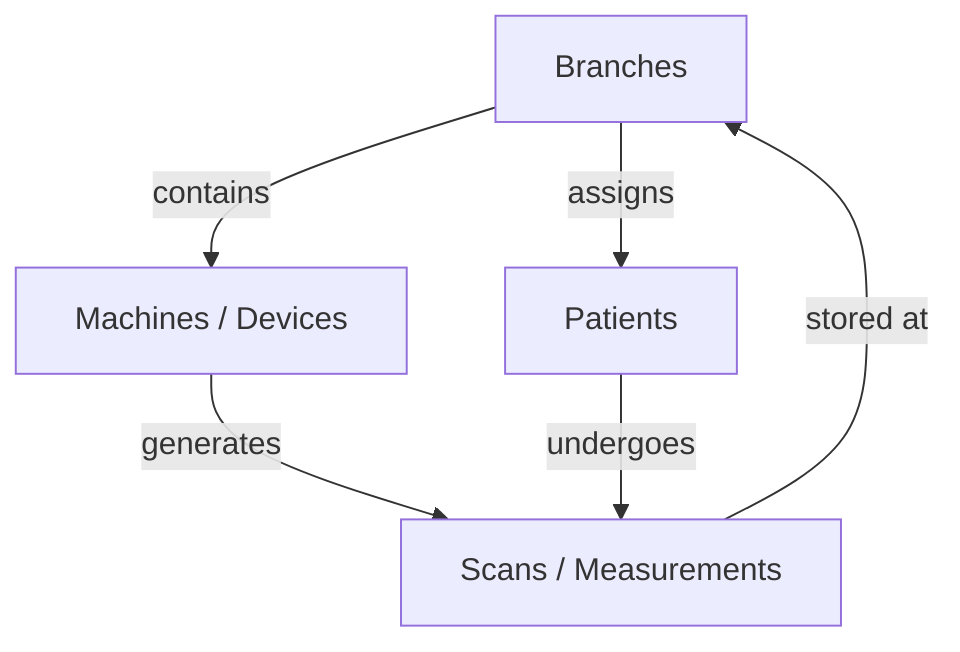

# Module Relationships and Data Flow

This document describes how data is associated across the different modules of the Mayurah Health Insights platform, specifically focusing on the hierarchy between **Branches**, **Machines (Devices)**, and **Patients**.

---

## 1. Branches Module (Root Entity)
The "Branches" module serves as the primary organizational unit. All data in the system (Machines, Staff, Patients, and Scans) is ultimately contextualized by the Branch it belongs to.

- **Data Source:** Currently retrieved from `mockData.ts` via the `branches` constant.
- **UI Logic:** The `Branches.tsx` page maps through all branches to display high-level performance metrics.
- **Relationship:** A Branch acts as a container for multiple Machines and a patient population.

## 2. Machines Module (Per Branch)
Machines (also referred to as "Devices" or "BCM units") are physical hardware units deployed at specific branches.

- **Association Logic:** Each Machine object contains a `branchId` field.
- **Mapping in UI:** 
  - To find all machines for a specific branch (as seen in `BranchDetail.tsx`):
    ```typescript
    const branchDevices = devices.filter((d) => d.branchId === branch.id);
    ```
- **Relationship:** One-to-Many (One Branch has many Machines).

## 3. Patients & Measurements (Flow)
Patients are associated with branches primarily through their measurement history (Scans), although they also have a primary branch assignment.

### Branch → Patient Association
- **Primary Assignment:** Each patient has a `primaryBranchId`.
- **Scan-based Association:** A patient is considered "active" at a branch if they have scans recorded under that branch's ID.

### Branch → Scan Association
- **Mapping in UI:** 
  - To find all scans/measurements for a branch:
    ```typescript
    const branchScans = scans.filter((s) => s.branchId === branch.id);
    ```
  - From these scans, the system identifies which patients have visited that branch.

---

## Data Hierarchy Diagram



## Screen-specific Data Loading

| Screen | Primary Data Focus | Relationship Mapping |
| :--- | :--- | :--- |
| **Branches List** | Full `branches` array | None (Base List) |
| **Branch Detail** | Single `branch` | `devices.filter(branchId)` + `scans.filter(branchId)` |
| **Machines List** | Full `devices` array | Filterable by `branchId` |
| Machine Detail | Single `device` | Pulls logs matching `deviceId` |
| **Patients List** | Dynamic `usePatients` or `patients` | Filterable by `primaryBranchId` |
| **Patient Detail** | Single `patient` | Pulls all `scans` matching `patientId` |

---

## Screen-Wise Data Mapping

Each screen in the application has a specific data loading strategy based on its functional role.

### 1. Operations Dashboard (`Dashboard.tsx`)
- **Primary Data:** 
  - `branches`: Used for branch-wise scan distribution charts.
  - `totalsAcrossBranches`: Global KPIs (Total Branches, Connected Devices, total scans today).
  - `scans` (recent 6): Real-time activity feed.
  - `alerts`: Scans with `Critical` status.
- **Loading Strategy:** Combined analytics view pulling from the global mock/dynamic store.

### 2. Monitoring - Patients (`Patients.tsx`)
- **Primary Data:** 
  - `patients` (Mock): Static data for local testing.
  - `dynamicPatients` (Backend): Fetched via `usePatients` hook from `/api/v1/patients/impedance/`.
- **Relationship:** Each patient is linked to a `primaryBranchId` for filtering.

### 3. Monitoring - Devices/Machines (`Devices.tsx`)
- **Primary Data:** `devices` array.
- **Relationship:** Machines are filtered by `branchId`. The list displays machine health (`status`) and technician assignments.

### 4. Branch Management (`Branches.tsx` & `BranchDetail.tsx`)
- **Branches List:** High-level overview of all locations using the `branches` metadata.
- **Branch Detail:** 
  - Fetches the specific `branch` by ID.
  - Dynamically calculates `branchDevices` (all machines assigned to this branch).
  - Aggregates `branchScans` to drive the 7-day scan trend analytics.

### 5. Patient Clinical Report (`PatientDetail.tsx`)
- **Primary Data:** `Measurement` object (within a Scan).
- **Advanced Logic:** 
  - Switches between `mockPatient` and `dynamicData` (from `/api/v1/patients/impedance/{id}/`).
  - Maps 50+ biometric parameters from `lefuBodyData`.
  - Visualizes clinical trends and anatomical segmental distribution.

### 6. Analytics & Intelligence (`Analytics.tsx`)
- **Primary Data:** System-wide `scans` and `branches`.
- **Focus:** Demographic distribution (Gender, Age), Obesity trends, and system-wide throughput.

### 7. Alerts & Critical Events (`Alerts.tsx`)
- **Primary Data:** Computed from the `scans` array where `status === "Critical"`.
- **Focus:** Enabling fast clinical intervention by grouping critical scans by branch.
