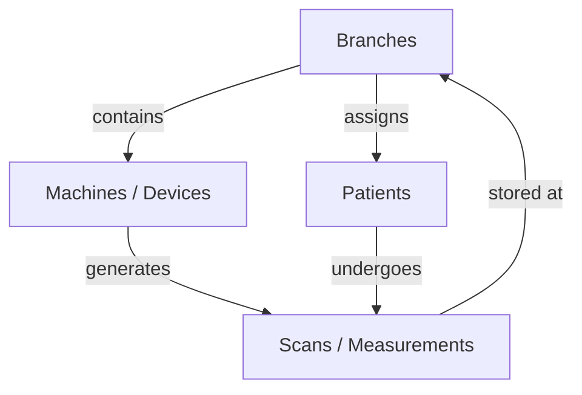

# Mayurah Health Insights Platform

A professional, clinical-grade body composition and physiological monitoring platform designed for **Mayurah Hospitals**. This platform provides real-time data synchronization across multiple hospital branches, enabling centralized patient analytics and high-fidelity diagnostic reporting.

---

## 🚀 Key Features

- **Multi-Branch Monitoring**: Centralized dashboard to monitor diagnostic performance and scan throughput across all hospital locations.
- **Advanced Biometric Mapping**: Integration with the **LeFu SDK** to map over 50+ physiological parameters, including segmental muscle/fat analysis, body cell mass, and raw impedance values.
- **Professional PDF Reporting**: Automated generation of data-dense, professional patient reports featuring 3D anatomical visualizations and clinical trend analysis.
- **AI-Powered Insights**: Real-time evaluation of patient health scores, metabolic age, and clinical risk flags based on backend diagnostic logic.
- **Historical Trend Tracking**: Seamless visualization of patient progress across multiple scan sessions for effective long-term health management.

---

## 🏛 Core Architecture & Hierarchy

The platform is built on a robust, hierarchical data model that ensures clinical integrity and operational scalability. Understanding the relationship between entities is key to navigating the system.

### 1. Project Hierarchy
- **Branches**: The primary organizational unit. Every Machine and Patient is ultimately associated with a Branch.
- **Machines (Devices)**: Physical hardware units deployed at specific branches. They generate the raw measurement data.
- **Patients**: Individuals associated with a primary branch. Their measurement history is tracked across all visits.
- **Scans (Measurements)**: The core data points generated by Machines for a specific Patient.

### 2. Data Hierarchy Diagram



### 3. Key Modules
- **Operations Dashboard (`Dashboard.tsx`)**: Global KPIs, real-time activity feeds, and critical clinical alerts.
- **Clinical Data Engine (`PatientDetail.tsx`)**: Translates raw bioimpedance data into 50+ clinical metrics with age/gender-specific medical standards.
- **Analytics & Intelligence (`Analytics.tsx`)**: System-wide demographic trends and obesity level distribution charts.

---

## 🛠 Technical Stack

- **Framework**: React 18 + TypeScript
- **State Management**: React Query (TanStack)
- **Styling**: Tailwind CSS (Custom "Mayurah Teal" Design System)
- **Visuals**: Recharts (Trends) + SVG anatomical diagrams
- **PDF Engine**: `jspdf` + `html-to-image`
- **Build Tool**: Vite

---

## 📖 Extended Documentation

For deeper technical insights, please refer to the specialized documentation files:

- [Module Architecture](MODULE_ARCHITECTURE.md): Detailed breakdown of module relationships and loading strategies.
- [Data Mapping Guide](DATA_MAPPING.md): Comprehensive list of clinical parameters and their backend mappings.
- [Web Endpoints](web_endpoints.md): API documentation for Django backend integration.

---

## 🏗 Setup & Installation

1. **Clone and Install**:
   ```bash
   git clone <repository-url>
   npm install
   ```
2. **Environment**:
   Set `VITE_API_BASE_URL` in a `.env` file.
3. **Run**:
   ```bash
   npm run dev
   ```

---

## ⚖️ Disclaimer

The parameters provided by this platform are measured based on bioimpedance analysis technology. Its application scope is limited to health promotion and fitness guidance. It is intended as a reference for body shape control and long-term fitness testing and should not be used as the sole basis for medical diagnosis.

© 2026 Mayurah Hospitals. All rights reserved.
