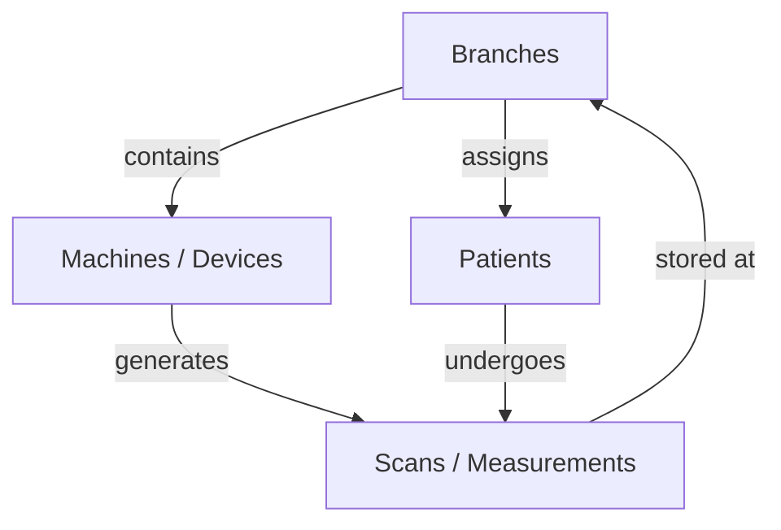

# Mayurah Health Insights Platform

A professional, clinical-grade body composition and physiological monitoring platform designed for **Mayurah Hospitals**. This platform provides real-time data synchronization across multiple hospital branches, enabling centralized patient analytics and high-fidelity diagnostic reporting.

## 🚀 Key Features

- **Multi-Branch Monitoring**: Centralized dashboard to monitor diagnostic performance and scan throughput across all hospital locations.
- **Advanced Biometric Mapping**: Integration with the **LeFu SDK** to map over 50+ physiological parameters, including segmental muscle/fat analysis, body cell mass, and raw impedance values.
- **Professional PDF Reporting**: Automated generation of data-dense, professional patient reports featuring 3D anatomical visualizations and clinical trend analysis.
- **AI-Powered Insights**: Real-time evaluation of patient health scores, metabolic age, and clinical risk flags based on backend diagnostic logic.
- **Historical Trend Tracking**: Seamless visualization of patient progress across multiple scan sessions for effective long-term health management.

---

## 🏛 Project Architecture

The application is built on a robust, hierarchical data model that ensures clinical integrity and operational scalability.

### 1. Operations Dashboard (`Dashboard.tsx`)
The nerve center of the application, providing real-time operational KPIs:
- **Global KPIs**: Total branches, connected diagnostic units, and daily scan volume.
- **Real-time Activity**: Live feed of incoming patient scans across the hospital network.
- **Critical Alerts**: Immediate notification of "Critical" status scans requiring clinical intervention.

### 2. Clinical Data Engine (`PatientDetail.tsx` & `usePatientDetail.ts`)
Handles the heavy lifting of physiological data processing:
- **Deep Mapping**: Translates raw backend JSON from the `/api/patient-impedance/` endpoint into 50+ clinical metrics.
- **Segmental Analysis**: Maps anatomical data (Left/Right Arm, Trunk, Left/Right Leg) to 3D diagnostic diagrams.
- **Dynamic Standards**: Compares patient values against age/gender-specific medical ranges provided by the AI engine.

### 3. Patient Management (`Patients.tsx` & `usePatients.ts`)
Comprehensive patient registry with advanced filtering:
- **Server-Side Search**: Efficient lookup by Patient UHID or Name.
- **Date Filtering**: Specialized clinical date range selectors for historical audit reporting.
- **Branch Context**: View patient populations scoped to specific hospital branches.

### 4. Device & Branch Management (`Branches.tsx` & `Devices.tsx`)
Infrastructure monitoring for hospital IT and operations:
- **Health Monitoring**: Real-time status tracking of diagnostic hardware units.
- **Branch Analytics**: Performance trends and scan distribution charts for hospital management.

---

## 📊 Data Hierarchy



---

## 🛠 Technical Stack

- **Framework**: React 18 with TypeScript for type-safe clinical data handling.
- **State Management**: React Query (TanStack Query) for robust API caching and synchronization.
- **Styling**: Tailwind CSS with a custom professional "Mayurah Teal" clinical design system.
- **Data Visualization**: Recharts for interactive clinical trends and radar-based balance profiles.
- **Reporting**: `html2pdf.js` for high-fidelity, print-ready diagnostic reports.
- **Routing**: React Router 6 for seamless multi-module navigation.

---

## 📡 API Integration

The platform is configured to communicate with a Django-based backend. Key endpoints include:
- `GET /api/patient-impedance/`: List and filter patient scans (supports pagination and date range).
- `GET /api/patient-impedance/{id}/`: Detailed physiological profile and AI-generated insights.

---

## 🏗 Setup & Installation

1. **Clone the repository**:
   ```bash
   git clone <repository-url>
   ```
2. **Install dependencies**:
   ```bash
   npm install
   ```
3. **Configure Environment Variables**:
   Create a `.env` file and set the `VITE_API_BASE_URL` to your backend endpoint.
4. **Run Development Server**:
   ```bash
   npm run dev
   ```

---

## ⚖️ Disclaimer

The parameters provided by this platform are measured based on bioimpedance analysis technology. Its application scope is limited to health promotion and fitness guidance. It is intended as a reference for body shape control and long-term fitness testing and should not be used as the sole basis for medical diagnosis.

© 2026 Mayurah Hospitals. All rights reserved.
